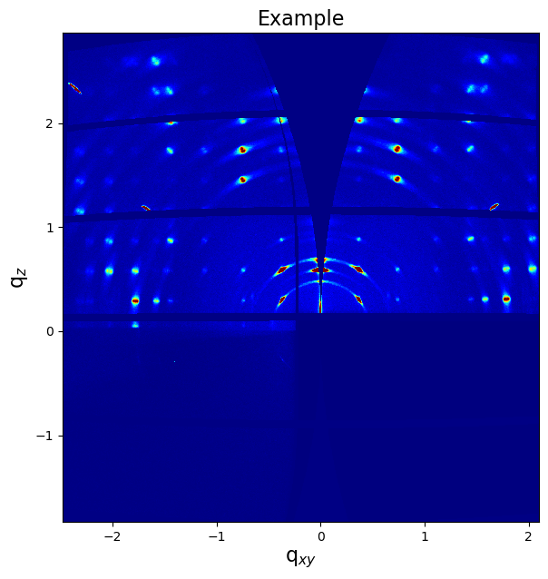
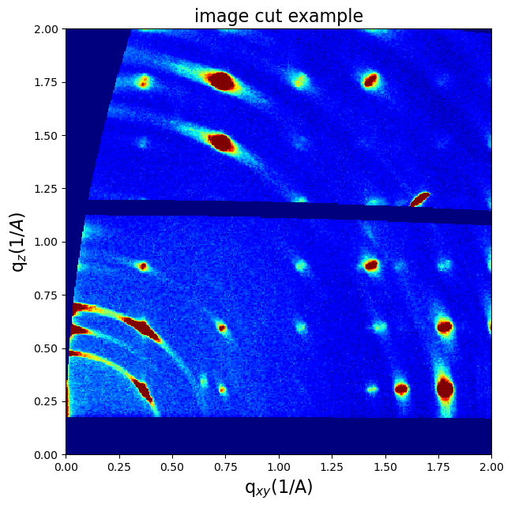
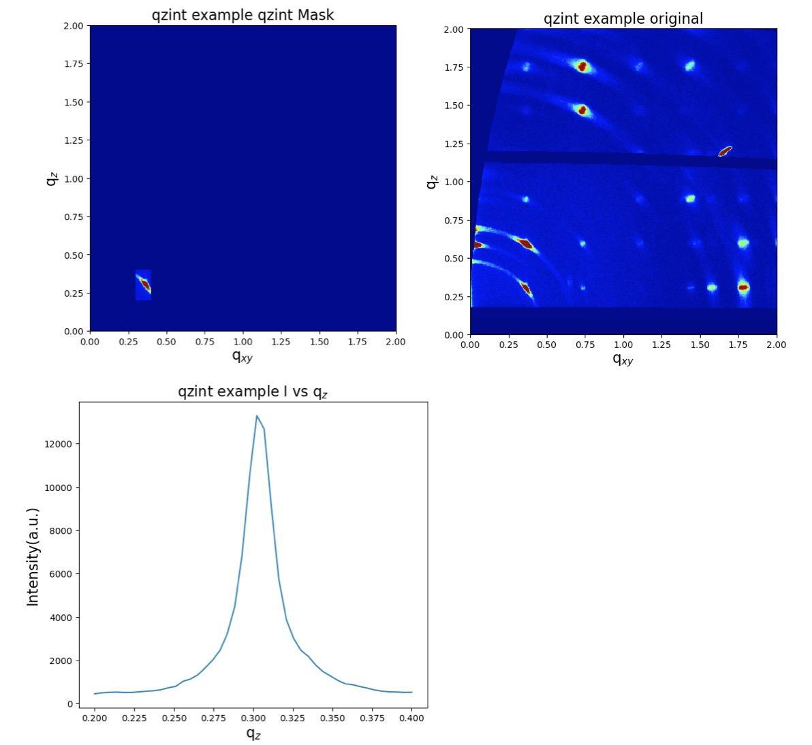
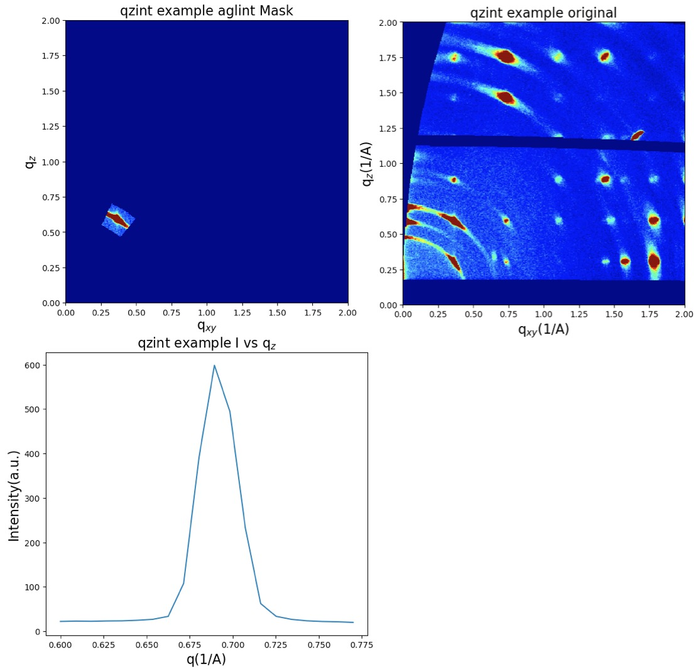

# GIWAXS image tool in Python

Zihan Zhang (zihan.zhang-1@colorado.edu)

This is an example of the GIWAXS class in python.

Import libraries, the GIWAXS class is included in GIWAXS.py.

=== "Code"

    ```python
    import numpy as np
	import pandas as pd
	import math
	import matplotlib.pyplot as plt
	import matplotlib.cm as cm
	import scipy.io
	from scipy.optimize import curve_fit
	import GIWAXS
	import scipy.misc
	import os
	from PIL import Image
	import tifffile
    ```

Load experiment data (.tiff file) with the coordinate. And create a GIWAXS object by M=GIWAXS.GIWAXS(...).

=== "Code"

    ```python
    # read .tiff file
	dirr = ""
	filename = "test_qmap"
	path=os.path.join(dirr,filename)
	f = tifffile.imread(path+'.tiff')
	Giwaxs_data=np.array(f)

	qzmax=np.max(np.loadtxt('test_qz.txt'))/10
	qzmin=np.min(np.loadtxt('test_qz.txt'))/10
	qxymax=np.max(np.loadtxt('test_qxy.txt'))/10
	qxymin=np.min(np.loadtxt('test_qxy.txt'))/10
	qz=[qzmin,qzmax]
	qxy=[qxymin,qxymax]

	M=GIWAXS.GIWAXS(Giwaxs_data,qxy,qz,'Example',dirr)
	M.switch_qxy()
	M.switch_qz()
	M.imshow()
	print('qz=',qz)
	print('qxy=',qxy)
    ```

=== "Output"

    qz= -1.8346400457410241 2.8658707336457097

	qxy= -2.4817527502473498 2.10232264951378
	

Then you can use cut() function to resize your GIWAXS image.

=== "Code"
	```python
	M.cut([0,2],[0,2])
	M.rename('image cut example')
	M.cut_imshow()
	```

=== "Output"

	

[peak_finder()]() can help you find the peaks in the cut image. Tune [neighborhood_size]() and [threshold]() to improve the performance. You can also print (q$_{xy}$, q$_z$) and q by setting [print_peak_position]() to [True]()

=== "Code"
	```python
	neighborhood_size=30
	threshold=30
	print_peak_position=True
	colorbar=0.1
	M.cut_imshow()
	M.peak_finder(neighborhood_size,threshold,print_peak_position)
	```

=== "Output"

	


[Qzint()]() integrate the selected area and gives the intensity vs q$_z$. [Qxyint()]() gives intensity vs q$_{xy}$.

=== "Code"
	```python
	qxy1=[0.3,0.4]
	qz1=[0.2,0.4]
	M.rename('qzint example')
	M.qzint(qxy1,qz1)
	M.qzint_imshow()
	```

=== "Output"

	

[aglint()]() integrate the selected sector to get intensity vs q. [qp]() defines the number of points in $q$. A smooth option is also offered to convolute the curve. 

=== "Code"
	```python
	angle=[-40,-25]
	qrange=[0.6,0.77]

	smooth1=False
	qp=20

	M.aglint(angle,qrange,qp,smooth=smooth1,Nsmooth=10)
	q0,I0=M.aglint_imshow()
	```

=== "Output"

	