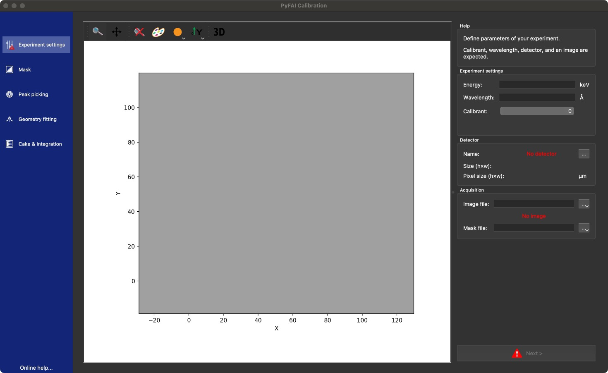
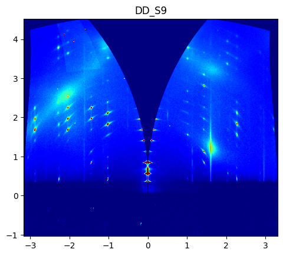

## Intro

GIWAXS data analysis has 5 steps in general:
!!! info "GIWAXS data analysis"
    - [ ] Calibration
    - [ ] Data reduction
    - [ ] 2D image generation
    - [ ] Area integration
    - [ ] Peak fitting

More advanced data analysis includes:

!!! warning ""
    - [ ] Peak search
    - [ ] GIWAXS pattern simulation
    - [ ] Phase identification
    - [ ] ...

### Calibration

Calibration is a method to determine the sample-detector distance and the relative detector postion. A material (thin film, plate, or powders on a flat surface) with known lattice parameter is measured at high incident angles (<2 degrees). The collected 2D image from the calibration material is used to derive the detector position. 

The quantitative calculation can be done using a python package 'pyFAI'. pyFAI is written in python2, so the installation is complicate. Here is a guide for pyFAI installation:

!!! info "pyFAI installation"
    - [ ] Do not install pyFAI on your PC. Use NSLS-II [jupyterhub](https://jupyter.nsls2.bnl.gov/hub) if you have the access. Most of the packages you will need for GIWAXS data analysis is installed there.
    - [ ] Use [SMI_analysis](https://wiki-nsls2.bnl.gov/beamline12ID/index.php/Jupyter_Notebook) package. This is a more advanced GIWAXS analysis package developed by beamline scientist at NSLS-II SMI beamline. pyFAI is included in SMI_analysis package. 
    - [ ] Use [pyWAXS](https://github.com/ToneyGroupCU/pyWAXS) package developed by Toney Group. You will need to be added to ToneyGroup on Github to get access. **(Recommanded)**
    - [ ] Directly install [pyFAI](https://github.com/silx-kit/pyFAI) on your PC. Good luck!

If you have successfully installed any of the package above, you can start to do the calibration calculation. In the terminal, type:

=== "Command"

    ```linux
    conda activate smi_analysis (or pyWAXS)
    pyfai-calib2
    ```

The pyFAI calibration UI will be opened: 


You will need to input: 
!!! info "Parameters"
    - [ ] Detector
    - [ ] Caliration materal
    - [ ] X-ray energy
    - [ ] 2d image for calibration (.tif)

to do the calibration calculation. The **.poni** file will be generated for the use in the next step (data reduction).

### Data reduction

The data reduction process convert the 2d detector image to the scattering instensity in the reciprocal space (qxy vs qz). This conversion considers the Ewald sphere correction with the experiment geometry. A missing wedge will appear after this step (if you use a grazing incident geometry).

A simple data reduction code is below:

=== "Import"
    ```python
    import numpy as np
    import os
    import pyFAI, fabio
    import matplotlib.pyplot as plt
    import matplotlib as mpl
    import pygix
    # from pylab import *
    import scipy.io as sio
    import scipy.integrate as integrate
    import image

    # %matplotlib inline
    print("Using pyFAI version", pyFAI.version)
    ```
=== "Function"
    ```python
    def pygix_reduction(dirr,filename,poni_dirr,poni_filename,orientation,incident_angle):
        path_poni=os.path.join(poni_dirr,poni_filename)
        pg = pygix.Transform()
        pg.load(path_poni)
        pg.sample_orientation =  orientation
        pg.incident_angle = incident_angle
        pg.tilt_angle = 0
        path=os.path.join(dirr,filename)
        data = fabio.open(path).data
        ii_reciprocal, qxy, qz =pg.transform_reciprocal(data, method = "bbox", unit = "nm")
        return ii_reciprocal, qxy, qz
    ```
=== "Figure"
    ```python
    dirr="temp"
    filename="DD_S9_12110220_0001.tif"
    poni_dirr="temp"
    poni_filename="Demi.poni"
    orientation=3
    incident_angle=3
    ii_reciprocal, qxy, qz=pygix_reduction(dirr,filename,poni_dirr,poni_filename,orientation,incident_angle)
    # show reduced image
    ii1=np.array(ii_reciprocal)
    plt.imshow(ii1,
              extent=(np.min(qxy)/10,np.max(qxy)/10,np.min(qz)/10,np.max(qz)/10),
              origin = "lower")  
    # plt.xlabel('q$_{xy}$ (1/A)')
    # plt.ylabel('q$_{z}$ (1/A)')
    plt.title('DD_S9')

    # set color bar
    plt.set_cmap('jet')
    lb = np.nanpercentile(data, 10)
    ub = np.nanpercentile(data, 90)
    plt.clim(lb,ub)
    ```
=== "Output"
    

### Area integration


