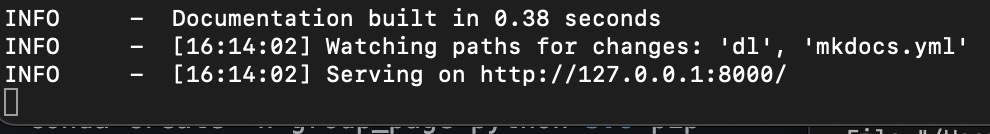

## How to contribute to this website

### 1. Join the Toney Group organization
This website is a code illustration from Toney group. You will need to join the Toney Group organization (Github) to make changes on the website. The manager of the organization (Keith, Tom, Andrew, Zihan) can add you to the organization.

### 2. Setup the environment and the repository
Download the source code

1. Use pip through terminal:

    1. go to the local path you want to download the code at

    2. Type in the terminal:
```python
git clone https://github.com/ToneyGroupCU/code_website.git
cd code_website
```

2. Use github desktop:

    1. log in your github account
    2. Click 'Add' --> clone repository --> ToneyGroupCU/code_website

### 3. Setup the environment
1. Install anaconda

2. Make a new environment 
```python
conda create -n group_page python=3.8 pip
conda activate group_page
```

3. Install the 'mkdocs' packages
```python
pip install -r requirements.txt
```

### 4. preview the website
```python
mkdocs -s serve
```



The website is now held on a local address http://127.0.0.1:8000.

You can then make changes of the source in 'dl' folder and you will see the changes at http://127.0.0.1:8000 in real time.

### 5. Build the website and upload it to github

```python
mkdocs build
```

Push the project to code_website repo through terminal
```python
git add --all
git commit -m "updating the group_page repo"
git push
```

Or you can do this on github desktop

You will see the changes a few minutes after uploading at: https://toneygroupcu.github.io/code_website/.